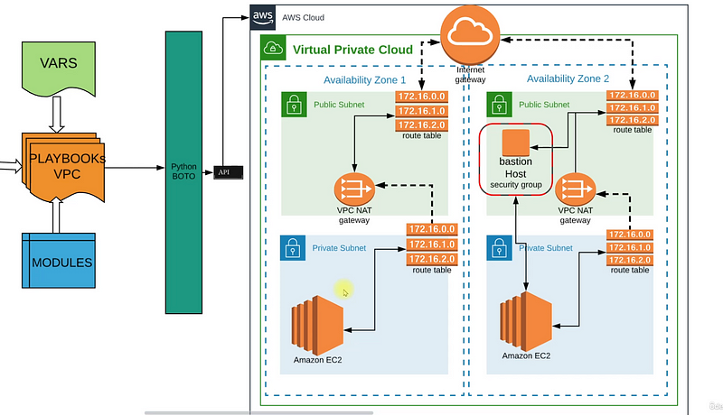
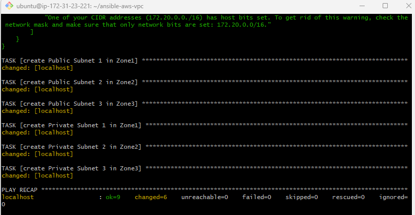

# Project-21: Cloud Automation with Ansible

[*Project Source*](https://www.udemy.com/course/devopsprojects/learn/lecture/23900232#overview)



## Prerequisites:
* AWS Account
* VScode
* GitHub account

## Flow of Execution:
* Login to AWS 
* Create ec2 instance to run ansible playbook
* Install Ansible
* Install boto
* Setup ec2 Role for ansible
* Create project directory
* Sample cloud task ( with key pair)
* Create Variables file for VPC & Bastion host
* Create VPC Setup Playbook
* Create Bastion host setup playbook
* Site.yml playbook to call both playbook at once

## Step-1: Ansible Setup for AWS
- I'll be using Ohio region for this project because it has 3 zones.
- Create an EC2 instance with the details below:
```sh
Name: Control-Machine
AMI: Ubuntu 20.04
Instance Type: t2.micro
SecGrp: ansible-sg
        allow SSH on port 22
keypair: ansible-ohio-key
```

- Userdata:
```sh
#!/bin/bash
sudo apt update
sudo apt install ansible -y
```
- Connect to ansible server with ssh and run the command below to check your version of ansible .
```sh
ansible --version
```


- Create an `IAM role` to use with EC2. Once role is created, attach it to your EC2 instance. `Actions` --> `Security` --> `Modify IAM Role` , select the role created.
```sh
Service: EC2
Policy: AdministratorAccess
Name: ansible-admin
```

- Install awscli and run the command below to confirm your identity.
```sh
sudo apt install awscli -y
aws sts get-caller-identity
```

## Step-2: Warm-up for AWS Cloud Playbooks
- Create a new directory and create a test playbook.
```sh
mkdir vpc-stack-vprofile
cd vpc-stack-vprofile/
vim test-aws.yml
```

- Ansible AWS cloud Automation documentation can be found on the official site: https://docs.ansible.com/ansible/2.9/modules/list_of_cloud_modules.html.
- Copy paste below content to test-aws.yml.
```sh
- hosts: localhost
  connection: local
  gather_facts: False
  tasks:
    - name: sample ec2 key
      ec2_key:
        name: sample
        region: us-east-2
```

- Playbook will fail when run it because Ansible requires you `installPython3` .


- We can install either using `pip`(python package manager) or with `apt`. Since we use AWS, `Boto` is Python SDK in AWS. search `boto` in `apt`.

```sh
ansible-playbook test-aws.yml
sudo apt search boto
sudo apt install python3-boto3 -y
```

- Run the playbook again, this time it is a success because boto3 is installed.


- A key is created but we do not have it downloaded on our local system, for that we should add more tasks to our `test-aws.yml` playbook.

```sh
- hosts: localhost
  connection: local
  gather_facts: False
  tasks:
    - name: sample ec2 key
      ec2_key:
        name: sample
        region: us-east-2
      register: keyout
    - debug:
        var: keyout
```

- Add another task to store the key in our local machine as it wasn't downloaded in the machine. From previous run, get the private_key from json file.

```sh
- hosts: localhost
  connection: local
  gather_facts: False
  tasks:
    - name: sample ec2 key
      ec2_key:
        name: sample
        region: us-east-2
      register: keyout

    - debug:
        var: keyout

    - name: store login key
      copy:
        content: "{{keyout.key.private_key}}"
        dest: ./sample-key.pem
      when: keyout.changed
```


## Step-3: Variables for VPC

- Create a GitHub repository to store our ansible-playbooks and use an IDE to create playbooks.
- Create 2 variables file. One named as `vpc_setup` and second one as `bastion setup`.
Vpc_setup file:
```sh
vpc_name: "Vprofile-vpc"

#VPC Range
vpcCidr: '172.20.0.0./16'

#Subnets Range
PubSub1Cidr: 172.20.1.0/24
PubSub2Cidr: 172.20.2.0/24
PubSub3Cidr: 172.20.3.0/24
PrivSub1Cidr: 172.20.4.0/24
PrivSub2Cidr: 172.20.5.0/24
PrivSub3Cidr: 172.20.6.0/24

#Region Name
region: "us-east-2"

#Zone Names
zone1: us-east-2a
zone2: us-east-2b
zone3: us-east-2c

state: present
```

Bastion setup file:
```sh
bastion_ami: ami-0911e88fb4687e06b # Amazon Linux-2 AMI-ID from us-east-2 region
region: us-east-2
MYIP: IP_address_of_your_laptop/32
keyName: vprofile-key
instanceType: t2.micro
```

- Once these files are ready commit/push to them GitHub, clone this repository in the Ansible server.

## Step-4: VPC Playbook

- Create a playbook `vpc_setup.yml` with details below:
```sh
- hosts: localhost
  connection: local
  gather_facts: False
  tasks:
    - name: Import VPC Variables
      include_vars: vars/vpc_setup

    - name: Create Vprofile VPC
      ec2_vpc_net:
        name: "{{vpc_name}}"
        cidr_block: "{{vpcCidr}}"
        region: "{{region}}"
        dns_support: yes
        dns_hostnames: yes
        tenancy: default
        state: "{{state}}"
      register: vpcout
```

- Commit/push changes to GitHub, go to Ansible server. First "Git pull", then run the playbook.

```sh
ansible-playbook vpc_setup.yml
```


- Check in AWS Console to view changes.


## Step-5: Subnets Playbook
- Add the information below to `vpc_setup.yml`
- Commit/push changes to GitHub.
```sh
#    - debug:
#        var: vpcout

    - name: create Public Subnet 1 in Zone1
      ec2_vpc_subnet:
        vpc_id: "{{vpcout.vpc.id}}"
        region: "{{region}}"
        az: "{{zone1}}"
        state: "{{state}}"
        cidr: "{{PubSub1Cidr}}"
        map_public: yes
        tags:
            Name: vprofile-pubsub1
      register: pubsub1_out

    - name: create Public Subnet 2 in Zone2
      ec2_vpc_subnet:
        vpc_id: "{{vpcout.vpc.id}}"
        region: "{{region}}"
        az: "{{zone2}}"
        state: "{{state}}"
        cidr: "{{PubSub2Cidr}}"
        map_public: yes
        tags:
          Name: vprofile-pubsub2
      register: pubsub2_out

    - name: create Public Subnet 3 in Zone3
      ec2_vpc_subnet:
        vpc_id: "{{vpcout.vpc.id}}"
        region: "{{region}}"
        az: "{{zone3}}"
        state: "{{state}}"
        cidr: "{{PubSub3Cidr}}"
        map_public: yes
        tags:
          Name: vprofile-pubsub3
      register: pubsub3_out

    - name: create Private Subnet 1 in Zone1
      ec2_vpc_subnet:
        vpc_id: "{{vpcout.vpc.id}}"
        region: "{{region}}"
        az: "{{zone1}}"
        state: "{{state}}"
        cidr: "{{PrivSub1Cidr}}"
        map_public: yes
        tags:
            Name: vprofile-privsub1
      register: privsub1_out

    - name: create Private Subnet 2 in Zone2
      ec2_vpc_subnet:
        vpc_id: "{{vpcout.vpc.id}}"
        region: "{{region}}"
        az: "{{zone2}}"
        state: "{{state}}"
        cidr: "{{PrivSub2Cidr}}"
        map_public: yes
        tags:
          Name: vprofile-privsub2
      register: privsub2_out

    - name: create Private Subnet 3 in Zone3
      ec2_vpc_subnet:
        vpc_id: "{{vpcout.vpc.id}}"
        region: "{{region}}"
        az: "{{zone3}}"
        state: "{{state}}"
        cidr: "{{PrivSub3Cidr}}"
        map_public: yes
        tags:
          Name: vprofile-privsub3
      register: privsub3_out
```

- Go to Ansible server. run Git pull, then run the playbook.


- Check AWS Console to see result output.
  

## Step-6: Internet Gateway & Public Route Table
- For Internet Gateway, add info below to `vpc_setup.yml` and Commit/push changes to GitHub.
```sh
- name: Internet Gateway Setup
      ec2_vpc_igw:
        vpc_id: "{{vpcout.vpc.id}}"
        region: "{{region}}"
        state:  "{{state}}"
        tags:
          Name: vprofile-igw
      register: igw_out
```

- Go to Ansible server. First Git pull, then run the playbook.


- For Public Route Table, add info below to `vpc_setup.yml` and Commit/push changes to GitHub.
```sh
- name: Setup Public Subnet Route Table
      ec2_vpc_route_table:
        vpc_id: "{{vpcout.vpc.id}}"
        region: "{{region}}"
        tags:
          Name: Vprofile-PubRT
        subnets:
            - "{{ pubsub1_out.subnet.id }}"
            - "{{ pubsub2_out.subnet.id }}"
            - "{{ pubsub3_out.subnet.id }}"
        routes:
          - dest: 0.0.0.0/0
            gateway_id: "{{ igw_out.gateway_id }}"
      register: pubRT_out
```
- Go to Ansible server. First Git pull, then run the playbook.


## Step-7: NAT Gateway & Private Route Table
- Add info below to `vpc_setup.yml` and Commit/push changes to GitHub.

```sh
- name: NAT Gateway1 Setup and allocate new EIP if NATGW does not exist yet in the subnet
      ec2_vpc_nat_gateway:
        subnet_id: "{{ pubsub1_out.subnet.id }}"
        region: "{{region}}"
        state:  "{{state}}"
        wait: yes
        if_exist_do_not_create: true
      register: natgw_out

    - name: Setup Private Subnet Route Table
      ec2_vpc_route_table:
        vpc_id: "{{vpcout.vpc.id}}"
        region: "{{region}}"
        tags:
          Name: Vprofile-PrivRT
        subnets:
            - "{{ privsub1_out.subnet.id }}"
            - "{{ privsub2_out.subnet.id }}"
            - "{{ privsub3_out.subnet.id }}"
        routes:
          - dest: 0.0.0.0/0
            gateway_id: "{{ natgw_out.nat_gateway_id }}"
      register: privRT_out
```


- Print and store all variables into a text file then push to Git
```sh
- debug:
        var: "{{ item }}"
      loop:
        - vpcout.vpc.id
        - pubsub1_out.subnet.id
        - pubsub2_out.subnet.id
        - pubsub3_out.subnet.id
        - privsub1_out.subnet.id
        - privsub2_out.subnet.id
        - privsub3_out.subnet.id
        - igw_out.gateway_id
        - pubRT_out.route_table.id
        - natgw_out.nat_gateway_id
        - privRT_out.route_table.id
        

    - set_fact:
        vpcid: "{{ vpcout.vpc.id }}"
        pubsub1id: "{{ pubsub1_out.subnet.id }}"
        pubsub2id: "{{ pubsub2_out.subnet.id }}"
        pubsub3id: "{{ pubsub3_out.subnet.id }}"
        privsub1id: "{{ privsub1_out.subnet.id }}"
        privsub2id: "{{ privsub2_out.subnet.id }}"
        privsub3id: "{{ privsub3_out.subnet.id }}"
        igwid: "{{ igw_out.gateway_id }}"
        pubRTid: "{{ pubRT_out.route_table.id }}"
        natgwid: "{{ natgw_out.nat_gateway_id }}"
        privRTid: "{{ privRT_out.route_table.id }}" 
        cacheable: yes

    - name: Create variables file for vpc Output
      copy:
        content: "vpcid: {{ vpcout.vpc.id }}\npubsub1id: {{ pubsub1_out.subnet.id }}\npubsub2id: {{ pubsub2_out.subnet.id }}\npubsub3id: {{ pubsub3_out.subnet.id }}\nprivsub1id: {{ privsub1_out.subnet.id }}\nprivsub2id: {{ privsub2_out.subnet.id }}\nprivsub3id: {{ privsub3_out.subnet.id }}\nigwid: {{ igw_out.gateway_id }}\npubRTid: {{ pubRT_out.route_table.id }}\nnatgw1id: {{ natgw_out.nat_gateway_id }}\nprivRTid: {{ privRT_out.route_table.id }}"

        dest: vars/output_vars
```


* Copy vars output and commit to git
* git add . 
* git commit -m "name"
* git config - global user.name "your username"
* git config - global user. Email "your email"
* run git push and pull changes from IDE


## Step-9: Bastion Host Setup

- Create `bastion-instance.yml` file instance, commit-push to GitHub.
```sh
---
- name: Setup Vprofile Bastion Host
  hosts: localhost
  connection: local
  gather_facts: no
  tasks:
    - name: Import VPC setup variable
      include_vars: vars/bastion_setup

    - name: Import VPC setup Variable
      include_vars: vars/output_vars

    - name: Create vprofile ec2 key
      ec2_key:
        name: "{{ keyName }}"
        region: "{{ region }}"
      register: key_out

    - name: Save private key into file bastion-key.pem
      copy:
        content: "{{ key_out.key.private_key }}"
        dest: "./bastion-key.pem"
        mode: 0600
      when: key_out.changed

    - name: Create Sec Grp for Bastion Host
      ec2_group:
        name: Bastion-host-sg
        description: Allow port 22 from everywhere and all port within sg
        vpc_id: "{{ vpcid }}"
        region: "{{ region }}"
        rules:
          - proto: tcp
            from_port: 22
            to_port: 22
            cidr_ip: "{{ MYIP }}"
      register: BastionSG_out

    - name: Creating Bastion Host
      ec2:
        key_name: "{{ keyName }}"
        region: "{{ region }}"
        instance_type: "{{ instanceType }}"
        image: "{{ bastion_ami }}"
        wait: yes
        wait_timeout: 300
        instance_tags:
          Name: "Bastion_host"
          Project: Vprofile
          Owner: DevOps Team
        exact_count: 1
        count_tag:
          Name: "Bastion_host"
          Project: Vprofile
          Owner: DevOps Team
        group_id: "{{ BastionSG_out.group_id }}"
        vpc_subnet_id: "{{ pubsub3id }}"
        assign_public_ip: yes
      register: bastionHost_out
```


## Step-10: Cleanup
- Clean up resources